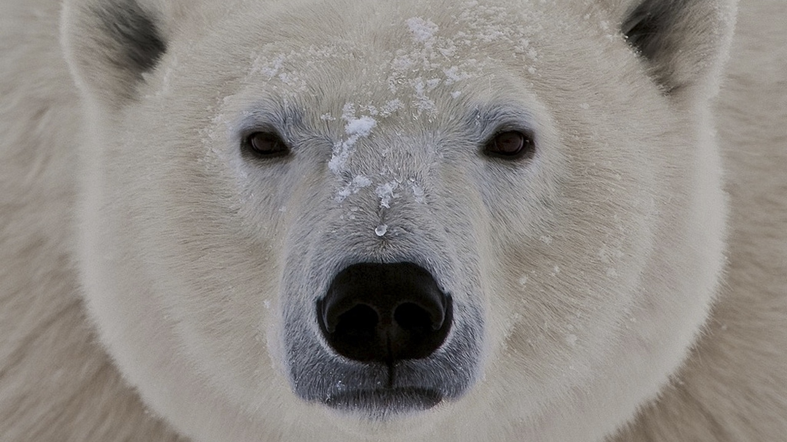

# TheDesktopBear

## How to Excute
 

`TheDesktopBear.exe`

TheDesktopBear\bin\Release\TheDesktopBear.exe 경로를 실행합니다!

## 최종발표영상
 

## OverView
이 프로젝트는 Window화면에서 돌아다니는 `곰`을 표현하였습니다.

같은 네트워크 안에 있는 또 다른 곰과 파일을 주고 받을 수 있습니다.

통신이 되지 않는다면 [이곳](#how-to-setting)을 참조하여 주세요!

## 개발환경
- Windows 10
- Visual Studio 2019
- C# .net Framework
  

## How to Setting
[Readme](./how_to_setting/Readme.md)

## Members
[곽명섭](https://github.com/myungsup1250)
[임현우](https://github.com/IHW213)
[김수빈](https://github.com/kimziou77)
[이현빈](https://github.com/Phaskal)

